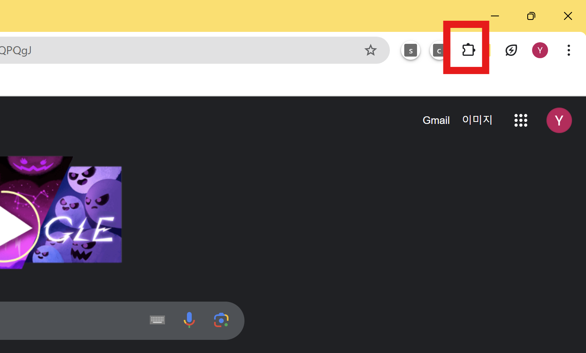

# Download Our Extension

Click the button below to download the zipped extension folder:

[Download Extension Folder](https://drive.google.com/file/d/15StMp5-P02C6nGWK9EkOBfEI2ufOH93r/view?usp=sharing)

Click the button below to download Python:

[Download Python](https://www.python.org/downloads/)

## Setup Instructions

### Step 1: Download the files provided above to your computer.

### Step 2: Open Google Chrome. In the top right corner of the browser, click the **Extensions** icon (a puzzle piece icon next to the URL bar).

Click the **Manage extensions** button.

### Step 3: Download the zipped extension folder, and upload the `combine_all_test` folder.

### Step 4: On the top right corner, to the right of the URL bar, there is a puzzle piece. Click it and our extension "combine" will appear.

### Step 5: Click the three dots for our extension and tap "View Web Permission."

### Step 6: Allow the camera permission and the microphone permission.

### Step 7: Click the three dots again, tap "This Can Read And Change Data Site" and choose "When You Click the Extension."

### Step 8: Go to the website you want the extension for.

### Step 9: Tap the puzzle again, then tap our extension.

### Step 10: Start to Use!
